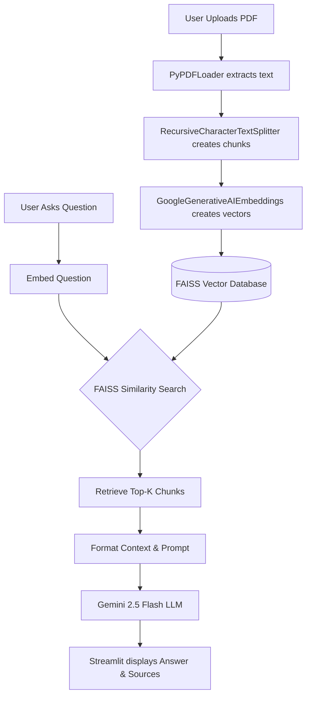

# PDF Knowledge Assistant – RAG Powered Document Question Answering System

## Project Overview
This project is an end-to-end Retrieval-Augmented Generation (RAG) system built with **Streamlit**, **LangChain**, **FAISS**, and **Google Gemini 2.5 Flash**. It allows users to upload a PDF document and ask questions about its content.

The system extracts text from the PDF, splits it into manageable chunks, converts those chunks into numerical embeddings, and stores them in a local FAISS vector database. When a user asks a question, the system retrieves the most relevant chunks and uses Gemini to generate a contextual, accurate answer.

## Features
- **PDF Upload**: Upload any PDF document via a clean Streamlit interface.
- **Contextual Q&A**: Ask questions and get answers based strictly on the uploaded document.
- **Source Attribution**: Expandable UI to view the exact text chunks used by the LLM.
- **Explicit RAG Pipeline**: Built without "black-box" abstractions (like `create_retrieval_chain`) for maximum transparency and educational value.
- **Session History**: Maintains chat history across interactions.

## Architecture Diagram



## Folder Structure
```text
pdf-knowledge-assistant/
├── app.py                 # Main Streamlit application and UI
├── requirements.txt       # Project dependencies pinned to stable versions
├── .env.example           # Example environment variables
├── src/                   # Core application logic
│   ├── __init__.py
│   ├── config.py          # Logging and Env Var setup
│   ├── constants.py       # Magic numbers (Chunk size, Top K)
│   ├── loader.py          # PDF text extraction
│   ├── splitter.py        # Text chunking logic
│   ├── embeddings.py      # Google Embeddings setup
│   ├── vectorstore.py     # FAISS database creation
│   ├── rag.py             # Explicit retrieval and LLM call pipeline
│   └── prompts.py         # System prompt templates
├── README.md              # Project documentation
└── INTERVIEW_GUIDE.md     # Q&A for software engineering interviews
```

## Installation and Running Locally

1. **Clone the repository**:
   ```bash
   git clone <your-repo-url>
   cd pdf-knowledge-assistant
   ```

2. **Create a virtual environment (Optional but recommended)**:
   ```bash
   python -m venv venv
   source venv/bin/activate  # On Windows use `venv\Scripts\activate`
   ```

3. **Install dependencies**:
   ```bash
   pip install -r requirements.txt
   ```

4. **Set up environment variables**:
   - Copy `.env.example` to `.env`.
   - Get a Google API Key from [Google AI Studio](https://aistudio.google.com/).
   - Add the key to your `.env` file: `GOOGLE_API_KEY=your_key_here`.

5. **Run the Streamlit application**:
   ```bash
   streamlit run app.py
   ```

## Deployment to Streamlit Community Cloud

This project is fully ready to be deployed for free on Streamlit Community Cloud.

1. **Push to GitHub**: Make sure all your code (including `requirements.txt`) is pushed to a public or private GitHub repository. *Do not push your `.env` file!*
2. **Log into Streamlit Cloud**: Go to [share.streamlit.io](https://share.streamlit.io/) and log in with your GitHub account.
3. **Deploy App**:
   - Click **New app**.
   - Select your repository, branch, and set the main file path to `app.py`.
4. **Set Secrets (Environment Variables)**:
   - Before clicking "Deploy", click on **Advanced settings**.
   - Under the **Secrets** field, paste your Google API key exactly like this:
     ```toml
     GOOGLE_API_KEY="your_actual_api_key_here"
     ```
   - Click Save, then **Deploy!**

## Future Improvements
- **Implement Lazy Loading**: For PDFs over 500 pages, the current `.load()` method could max out RAM. Switching to `.lazy_load()` would improve scalability.
- **Persistent Vector Store**: Currently, the FAISS store lives in Streamlit's session state. Saving it to disk would allow users to come back to a previously uploaded document without waiting for reprocessing.
- **Conversational Memory**: Currently, each question is treated in isolation. Adding `ConversationBufferMemory` would allow the user to ask follow-up questions like "Can you explain your last point more?".
