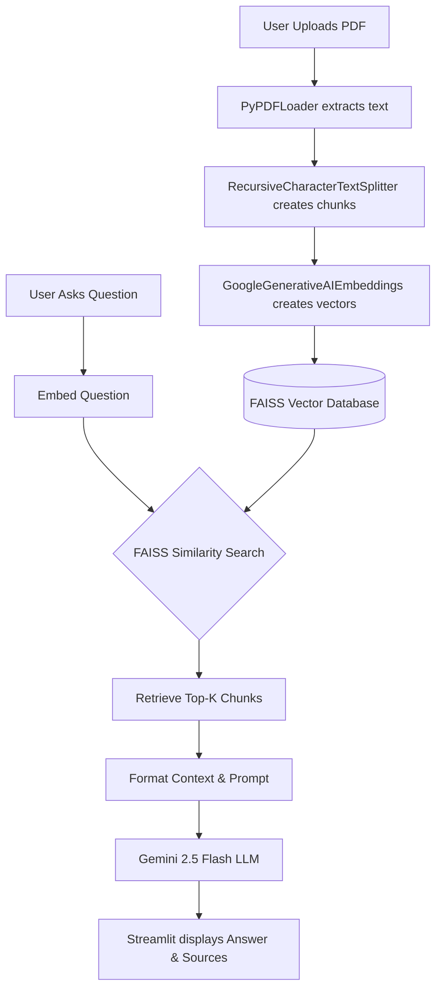

<div align="center">
  
# 📄 PDF Knowledge Assistant

**An end-to-end Retrieval-Augmented Generation (RAG) System**

[](https://www.python.org/)
[](https://streamlit.io/)
[](https://langchain.com/)
[](https://github.com/facebookresearch/faiss)
[](https://ai.google.dev/)

</div>

---

## 📖 Project Overview

This project is a **production-quality Document Question Answering System** built to demonstrate the power of RAG architectures. It allows users to upload any PDF document, parses its contents, and uses Google's Gemini LLM to answer user questions strictly based on the provided text.

The system is designed with **clean architecture**, modularity, and explicit RAG implementation (avoiding black-box wrappers) to maximize educational value and maintainability.

## ✨ Features

- 📤 **PDF Upload**: Seamlessly upload any PDF document via a clean Streamlit interface.
- 💬 **Contextual Q&A**: Ask questions and receive answers guaranteed to be sourced from the document.
- 🔍 **Source Attribution**: Expandable UI to view the exact text chunks and page numbers used by the LLM.
- 🏗️ **Explicit RAG Pipeline**: Built step-by-step for complete transparency into the retrieval and generation process.
- 📜 **Session History**: Maintains chat history across interactions.

## 🏗️ Architecture



## 📁 Folder Structure

```text
pdf-knowledge-assistant/
├── app.py                 # Main Streamlit application and UI
├── requirements.txt       # Project dependencies pinned to stable versions
├── .env.example           # Example environment variables
├── src/                   # Core application logic
│   ├── __init__.py
│   ├── config.py          # Logging and Env Var setup
│   ├── constants.py       # Magic numbers (Chunk size, Top K)
│   ├── loader.py          # PDF text extraction
│   ├── splitter.py        # Text chunking logic
│   ├── embeddings.py      # Google Embeddings setup
│   ├── vectorstore.py     # FAISS database creation
│   ├── rag.py             # Explicit retrieval and LLM call pipeline
│   └── prompts.py         # System prompt templates
├── README.md              # Project documentation
└── INTERVIEW_GUIDE.md     # Q&A for software engineering interviews
```

## 🚀 Installation and Local Setup

1. **Clone the repository**:
   ```bash
   git clone https://github.com/Shivaramakrishnaganji/PDF-Knowledge-Assistant.git
   cd PDF-Knowledge-Assistant
   ```

2. **Create a virtual environment (Recommended)**:
   ```bash
   python -m venv venv
   source venv/bin/activate  # On Windows use `venv\Scripts\activate`
   ```

3. **Install dependencies**:
   ```bash
   pip install -r requirements.txt
   ```

4. **Set up environment variables**:
   - Copy `.env.example` to a new file named `.env`.
   - Get a free Google API Key from [Google AI Studio](https://aistudio.google.com/).
   - Add the key to your `.env` file: `GOOGLE_API_KEY=your_key_here`.

5. **Run the application**:
   ```bash
   streamlit run app.py
   ```

## 🌐 Deployment to Streamlit Community Cloud

This project is fully ready to be deployed for **free** on Streamlit Community Cloud.

1. **Log into Streamlit Cloud**: Go to [share.streamlit.io](https://share.streamlit.io/) and log in with your GitHub account.
2. **Deploy App**:
   - Click **New app**.
   - Select your repository (`Shivaramakrishnaganji/PDF-Knowledge-Assistant`), branch (`main`), and set the main file path to `app.py`.
3. **Set Secrets**:
   - Before clicking "Deploy", click on **Advanced settings**.
   - Under the **Secrets** field, paste your Google API key:
     ```toml
     GOOGLE_API_KEY="your_actual_api_key_here"
     ```
   - Click Save, then **Deploy!**

## 🎯 Interview Preparation

Are you reviewing this project for a software engineering interview? Check out the [INTERVIEW_GUIDE.md](INTERVIEW_GUIDE.md) included in this repository. It contains comprehensive explanations of RAG concepts, design decisions, and common interview questions with answers.

## 🛠️ Future Improvements

- **Implement Lazy Loading**: For PDFs over 500 pages, the current `.load()` method could max out RAM. Switching to `.lazy_load()` would improve scalability.
- **Persistent Vector Store**: Currently, the FAISS store lives in Streamlit's session state. Saving it to disk would allow users to return to a previously uploaded document without waiting for reprocessing.
- **Conversational Memory**: Currently, each question is treated in isolation. Adding `ConversationBufferMemory` would allow the user to ask follow-up questions like *"Can you explain your last point more?"*.
